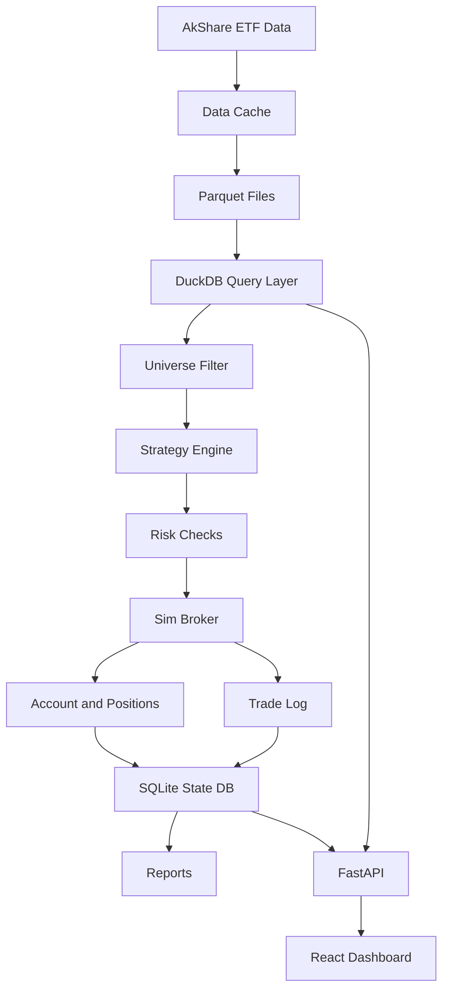

# Architecture

## 设计原则

- 本地优先：行情缓存、模拟账户、日志和报告都放在本地。
- 只模拟不实盘：第一阶段只生成虚拟交易和提醒。
- 规则可解释：每一笔交易必须有触发原因。
- 风控前置：任何买卖信号都必须经过仓位、现金、底仓和频率限制。
- 数据源可替换：第一版用 AkShare，后续可接入 Tushare、券商行情或本地 CSV。
- 存储分层：行情大表放 Parquet，回测聚合用 DuckDB，账户状态和交易流水放 SQLite。
- 前后端分离：Python 负责数据、策略、模拟和接口，React 只负责本地展示和交互。

## 模块划分

### data

负责行情获取与缓存。

主要职责：

- 获取 ETF 列表。
- 获取实时行情。
- 获取历史日线和分钟线。
- 标准化字段：`symbol`, `name`, `datetime`, `open`, `high`, `low`, `close`, `volume`, `amount`。
- 将日线、分钟线和实时快照转换成统一 OHLCV 格式。
- 写入本地缓存，减少重复请求。

参考项目：

- AkShare：接口来源。
- qteasy：本地数据管理思路。

### storage

负责本地数据库和文件存储。

第一版存储策略：

- `Parquet`：保存 ETF 日线、分钟线、实时快照等行情大表。
- `DuckDB`：直接查询 Parquet，做筛选、聚合、回测数据切片。
- `SQLite`：保存模拟账户状态、持仓、订单、成交、信号、风控拒绝原因、每日账户快照。

建议表：

```text
strategy_runs
etf_universe_daily
signals
orders
trades
positions
account_snapshots
```

暂不默认使用 MongoDB：

- 第一版数据主要是结构化时间序列和交易流水，关系表和列式文件更合适。
- MongoDB 需要额外服务，增加本地部署复杂度。
- 后续如果需要保存大量策略事件、盘口 JSON 或非结构化运行日志，可以作为可选存储接入。

### universe

负责 ETF 自动筛选。

候选指标：

- 日成交额。
- 成交量。
- 近 N 日波动率。
- 价格区间。
- 跟踪指数类别。
- 是否跨境、债券、货币、商品、行业 ETF。

第一版建议规则：

```text
成交额排名前 100
价格大于 0.5
近 20 日平均成交额大于 5000 万
近 20 日波动率在 0.8% 到 4% 之间
排除流动性明显不足或价格异常 ETF
```

### strategy

负责做T信号。

第一版建议实现两类策略：

- 网格做T：价格下跌到网格买入，上涨到网格卖出。
- 均值回归做T：价格偏离移动均线时买入/卖出。

每个信号需要返回：

```text
symbol
side: buy/sell
price
quantity
reason
confidence
strategy_name
```

### broker_sim

负责虚拟账户和模拟撮合。

主要对象：

- Account：现金、初始本金、总资产、收益。
- Position：ETF代码、持仓份额、可卖份额、成本价、市值、浮盈亏。
- Order：买卖方向、数量、价格、状态、触发原因。
- Trade：模拟成交记录。

撮合规则：

- 市价信号按当前价格成交。
- 限价信号在行情触达价格后成交。
- 买入检查现金是否足够。
- 卖出检查可卖份额是否足够。
- 按 100 份整数倍交易。
- 计入手续费和滑点。

参考项目：

- qteasy：交易成本、交易单位、T+1规则。
- RQAlpha：账户、订单、成交、风控分层。
- Fincept Terminal：PaperTrading 和 OrderMatcher 的模块分工。

### risk

负责风控。

第一版风控：

- 单只 ETF 最大仓位。
- 总仓位上限。
- 单日最大交易次数。
- 单日最大亏损。
- 最低现金保留。
- 底仓保护，卖出不能低于设定底仓。
- 连续亏损后暂停交易。

### reporting

负责报告。

第一版输出：

- CSV 交易日志。
- CSV 账户净值曲线。
- CSV 持仓快照。
- 控制台摘要。

第二版输出：

- HTML 报告。
- 收益曲线。
- 回撤图。
- 按 ETF、策略、时间段分组统计。

### api

负责本地 HTTP 接口，第一版使用 FastAPI。

建议接口：

```text
GET /api/health
GET /api/universe
GET /api/bars?symbol=510300&interval=1d
GET /api/signals?symbol=510300
GET /api/trades?symbol=510300
GET /api/positions
GET /api/account/equity
POST /api/backtest/run
```

接口只服务本地看板和本地脚本，不暴露真实账户能力。

### frontend

负责本地网页看板，第一版使用 React + Vite。

核心页面：

- ETF 观察列表。
- K 线图：蜡烛图、成交量、买卖点标记。
- 虚拟持仓：现金、仓位、市值、浮盈亏。
- 交易日志：成交、信号、风控拦截原因。
- 账户曲线：净值、收益率、最大回撤。

图表选择：

- K 线：TradingView Lightweight Charts。
- 收益、回撤、统计图：ECharts。

## 数据流



## 技术选型

第一版：

```text
Python 3.11+
pandas
akshare
pyyaml
fastapi
uvicorn
duckdb
pyarrow
sqlite
React + Vite
TradingView Lightweight Charts
ECharts
```

后续可选：

```text
APScheduler 定时任务
backtesting.py 或 vectorbt 参数扫描
MongoDB 或其他事件存储
C++/Rust 热点撮合模块
```
